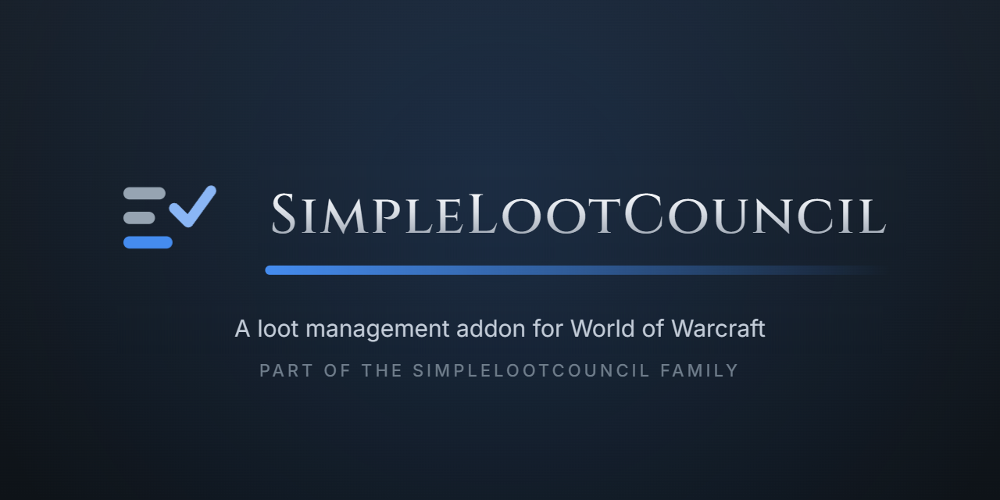

  <a href="https://discord.gg/nNRfxQApEB"><b>Discord</b></a> &nbsp;·&nbsp;
  <a href="https://ko-fi.com/laxxz"><b>Ko-fi</b></a> &nbsp;·&nbsp;
  <a href="https://github.com/SimpleLootCouncil/SimpleLootCouncil-Beta/releases"><b>Releases</b></a>

**SimpleLootCouncil** is a loot council for **Retail and Forever** raids. Where there is no master looter, the council votes on items sitting in a raider's bags inside the two-hour trade window. Raiders answer, the council votes, the loot master awards, and the holder's trade window fills itself.

## Bulletproof Loot Sessions

Never lose another loot session due to a reload, relog, or crash - SimpleLootCouncil has a robust run-recovery caching system that ensures you never have to restart a loot session, or miss a raider with a session start again.

- **Reloads** - raider, council or loot master. The window comes back with every answer and vote.
- **Relogs and crashes** - log back in and the run is rebuilt from what the rest of the group still holds.
- **Loading screens** - portals, hearths and zoning close your windows. SLC reopens them.
- **Loot master swaps** - hand loot over mid-run. The new loot master gets the whole run.

Awards made while you were reloading are held and applied once your run arrives, in the order they were made.

### Built for Retail Loot and WoW Forever

Votes happen on items still inside their trade window. When an item is awarded, its holder is told, and opening a trade with the winner fills it automatically. An award only counts as **delivered** once the item has actually changed hands.

On **WoW Forever**, master loot is back. The loot master holds the drop, the council votes the same way, and the item goes straight to the winner.

### Loot to Trade

One window lists everything you owe, grouped by player, each copy with its own trade-window clock. Owed items survive a full logout.

### Light on Your Raid

Answers from a 40-player raid cost about 0.04 ms each. The council table redraws in place, at most a few times a second, and addon messages are paced so other addons are never crowded out.

### A Council You Can Defend

Every award records the council as it stood: each candidate's answer, note, roll and vote. Hover any history row to see why an item went where it did.

### Bring Your History

Import award history from RCLootCouncil or Loothing, from saved data or a pasted CSV, so your council isn't starting blind.

## Features

- Live council voting
- Custom response buttons
- Council by name or guild rank
- Loot master delegation
- Autopass on unusable gear
- Equipped-gear and tier-set comparison
- Bonus-roll tracking
- Rolls, asked or generated
- Whisper answers for players without the addon
- Raid team view by guild rank
- Attendance
- CSV export
- WowUtils wishlist support
- SimulationCraft export

## Languages

SimpleLootCouncil runs on every World of Warcraft client language: rolls are read from chat, plurals and punctuation follow your language, and Cyrillic, Korean and Chinese text draws in the right font.

English (enUS, enGB) · Deutsch (deDE) · Français (frFR) · Español (esES, esMX) · Italiano (itIT) · Português (ptBR) · Русский (ruRU) · 한국어 (koKR) · 简体中文 (zhCN) · 繁體中文 (zhTW)

All interface text is English for now. Full translation is the next goal for SLC, but making sure it ran on every client localization was a top priority.

Every string is ready to translate. Translators are deeply desired, and any interested parties are encouraged to join the [Discord](https://discord.gg/nNRfxQApEB)!

## Getting Started

Install it with WowUp: **Install from URL** with this repo's address. Everyone who takes part needs it. The group leader runs loot by default. Add your council with `/slc council add Name-Realm`, and type `/slc` for settings or `/slc help` for every command.

## Support

SimpleLootCouncil is free. If it saves your raid some arguing, you can support its development on [Ko-fi](https://ko-fi.com/laxxz).

## Licence

All rights reserved - see [LICENSE](LICENSE). You are welcome to use the addon;
redistributing it or reusing its source needs a word first.